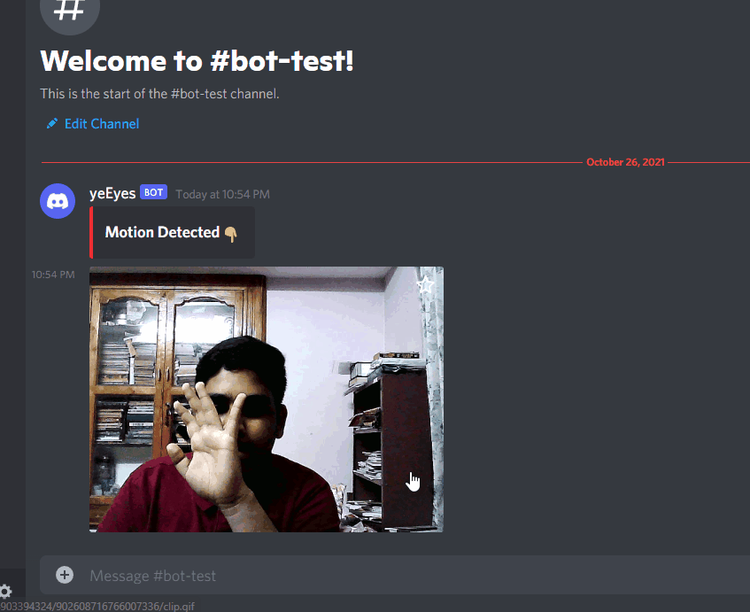

## **YeEyes** 👀
### OpenCv Motion Detection module with a discord webhook twist! ✨

<br/>

### SETUP 🔴
* Install pipenv
    ```bash
    $ pip3 install pipenv
    ```
* Install dependencies
    ```bash
    $ pipenv install
    ```
* Add necessary vars to [`.env.example`](.env.example)
    ```
    VIDEO_SOURCE=0
    HOOK_URL=your_discord_webhook_url
    CLIP_DURATION=5
    OUTPUT_DIR=null
    ```
* Run the monitor tool from pipenv environment
    ```bash
    $ pipenv run yeEyes
    ```
* Logs Example
    ```
    [INFO]:[2021-10-26 22:54:36,765]:[PERMIETER INTACT]
    [INFO]:[2021-10-26 22:54:37,280]:[MOTION DETECTED]
    [INFO]:[2021-10-26 22:54:37,281]:[MOTION DETECTED]
    [INFO]:[2021-10-26 22:54:42,412]:[TEMPERORY MONITOR SHUTDOWN]
    [INFO]:[2021-10-26 22:54:42,412]:[ENCODING GIF TO -> E:\Varsh_Code\Python\YeEyes\output\CLIP_26-10-2021-22-54-37.gif]
    [INFO]:[2021-10-26 22:54:43,460]:[REBOOT INTIATED]
    [INFO]:[2021-10-26 22:54:49,829]:[PERMIETER INTACT]
    ```
* **At Discord**
    <br/>
    

## PS: I know that was a weird me :P